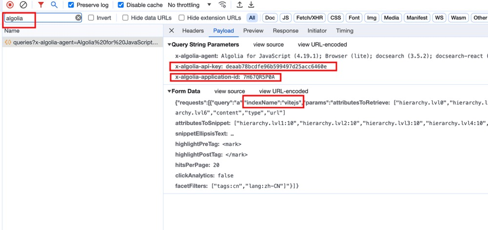

## 介绍
配置algolia appid等信息 在使用docsearch的在线文档网站中快速搜索，配置一次，下次就不用再打开浏览器输入网址搜索啦~

## 功能
1. 自定义热键，自定义分隔符
2. 支持自定义配置网站信息
3. 支持初始化关键词，搜索更快一步
4. 界面样式和官方保持一致，使用回车键打开新的浏览器窗口
5. 在utools的自带浏览器窗口打开搜索结果
6. 增加自定义docsearch的facetFilters参数,允许添加过滤参数
7. 删除所有配置项可以重新初始化配置项

## 配置说明
1. 鉴别官网文档是否支持docseach，一般搜索框弹窗有[algolia]支持的都可以 
2. 打开浏览器控制台，切换到network,搜索 [algolia]
3. 打开搜索框，随意搜索内容,抓包到网络请求 
4. utools 搜索docsearch设置
5. 唤起搜索的关键词，如热键配置【v】分隔符【:】则utools输入【v:computed】唤起搜索,docsearch 搜索相关关键词
6. 某些网站中文版和英文站的appId是不一样的，需要区分，有些则需要更具faceFilters过滤

名称 nnnnzs.cn

appid 
74Q4ZJSGIE

apiKey
0d46f0335810c99223e60c13412be864

indexName 
nnnnzs

```json
    {
      title: 'nnnnzs.cn',
      hotKey: 'n',
      appId: "74Q4ZJSGIE",
      indexName: 'nnnnzs',
      apiKey: '0d46f0335810c99223e60c13412be864',
      disabled: false,
    },
```